# 練習会日程調整ツール ユーザーガイド

**v2.0.0 / スケジュール担当者・参加者向け**
作成日: 2026年8月14日

この資料は、練習会の日程調整を進めるときに、各画面が何のためにあるか、どこを確認すべきかをまとめたガイドです。画面の細かな仕様を網羅するのではなく、判断に必要なポイントと注意点を中心に説明します。

> **画面画像について**
> 画像はv2.0.0時点の画面を、一時的なサンプル企画で操作して取得したものです。企画名・人数・日付・状態は実際の企画によって変わります。

## 1. 日程調整の全体像

スケジュール担当者は、次の6工程で企画を準備し、回答を集め、候補を比較して日程を公開します。

```text
企画情報の設定
  → 参加者の準備
  → 回答を集める
  → 探索条件の設定
  → 候補の作成・比較
  → 公開前確認
```

参加者は、担当者が受付を開始した企画について、概要を確認し、参加可能日時を入力して提出します。日程が公開された後は、`確定日程` で自分の予定を確認します。

### 画面に表示される状態

| 状態 | 意味 |
| --- | --- |
| `準備中` | 担当者が企画・名簿・条件を準備している段階 |
| `回答受付中` | 参加者が参加可能日時を入力・提出する段階 |
| `回答締切` | 回答を締め切り、候補の確認・確定へ進む段階 |
| `日程確定` | 公開された日程を確認する段階 |

参加者の入力状態は、`未入力`、`下書き`、`提出済み` で確認します。提出の扱いを変えるときは、保存ボタンの後に表示される最終確認まで完了させます。

## 2. スケジュール担当者向け

### 2.1 ホームは「現在地」と「次に確認する工程」を見る画面

企画を選ぶと、ホームに6工程の進み具合、日調対象人数、提出人数、保存候補数、公開日程の有無が表示されます。最初にホームを開き、次に確認すべき工程を把握します。

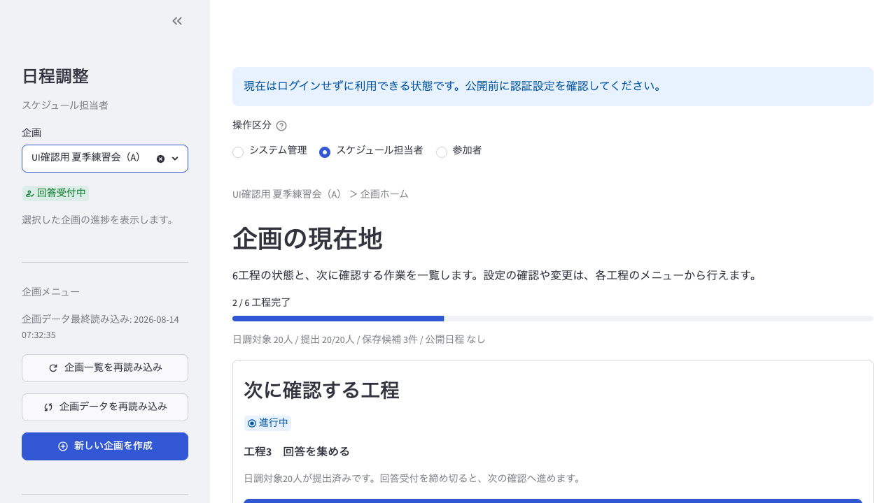

*図1. 担当者ホーム。企画の状態と、次に確認する工程を把握します。*

他の担当者が変更した後など、表示が古いと感じたときは、左側の再読み込みを使います。企画の選択肢を更新するものと、選択中の企画データを更新するものは役割が異なります。

### 2.2 工程1「企画情報の設定」は企画そのものを定義する画面

ここで扱うのは、企画名、説明・連絡事項、本番日です。参加者が回答できる期間・曜日・時限や入力締切は、工程3の `回答受付` で設定します。工程1と工程3を混同しないことが、v1からの変更点を理解するうえで重要です。

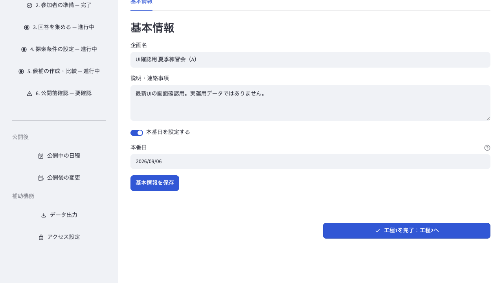

*図2. 工程1「企画情報の設定」。企画名・説明・本番日を確認して保存します。*

本番日を設定する場合は、参加者への連絡事項と日付が正しいことを確認します。保存後に工程を完了すると、次の工程へ進めます。

### 2.3 工程2「参加者の準備」は名簿と日調対象を整える画面

工程2には、次の役割があります。

- `班構成`: 班数と各班の構成を整える
- `参加者追加`: 個別に参加者を追加する、または共通名簿を取り込む
- `参加者設定`: 日調対象、班、期、文理、所属を設定する
- `アカウント`: 参加者が利用するアカウント情報を準備する

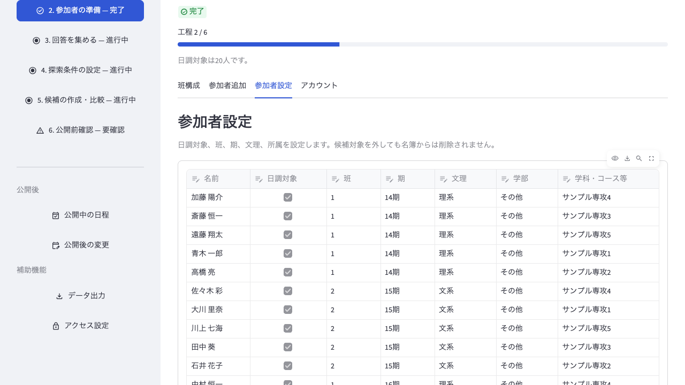

*図3. 工程2の「参加者設定」。日調対象・班・期・文理・所属を一覧で確認します。*

`日調対象` を外しても名簿から削除されるわけではありません。日程調整の対象から外すだけです。参加者を追加した時期によっては、承認済み・日調対象外として登録され、既存の日程には自動で追加されない場合があります。

### 2.4 工程3「回答を集める」は受付・状況・内容を分けて見る画面

工程3では、回答を集めるための設定と、集まった回答の確認を行います。

- `回答受付`: 企画状態、日調開始日・終了日、入力締切、対象曜日・時限、締切後の編集可否を設定する
- `提出状況`: 未入力・下書き・提出済みを確認し、連絡対象を絞り込む
- `回答内容`: 参加者の回答を一覧またはカレンダーで確認する
- `代理入力`: 電話や紙などで受け取った内容を、担当者が対象者の回答として入力する

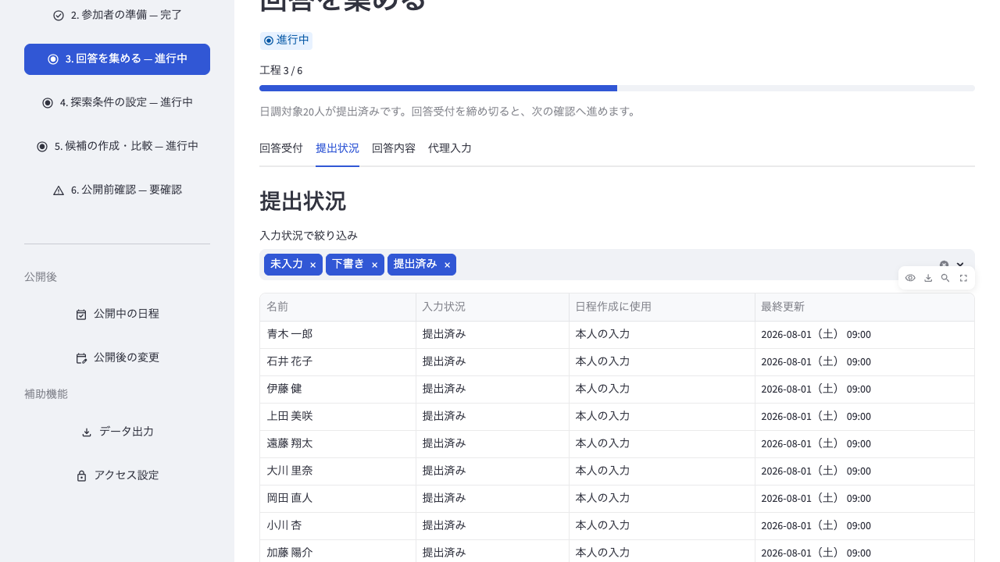

*図4. 「提出状況」。入力状況と、日程作成に使用されている回答の出所を確認します。*

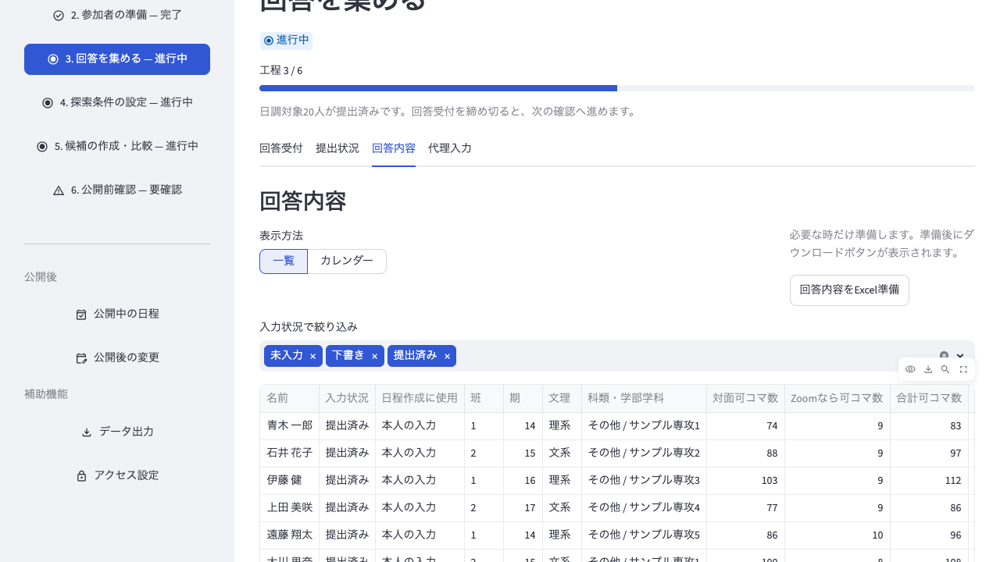

*図5. 「回答内容」。参加者ごとの回答を一覧またはカレンダーで確認します。*

回答受付中は、期間・曜日・時限が変更できない状態になります。受付条件を変えたい場合は、参加者への案内や既存回答への影響を確認してから状態を変更します。締切後の編集を許可する設定を使う場合は、回答締切後も回答が変わり得ることを担当者間で共有してください。

候補を作る前には、日調対象者の範囲、提出状況、代理入力の内容を確認します。全員の回答を候補に反映させたい場合は、回答をそろえてから受付を締め切ります。回答受付を締め切らなくても先行して確認できる画面はありますが、公開前には受付状態と警告を必ず確認します。

### 2.5 工程4「探索条件の設定」は条件の種類を分けて考える画面

工程4では、候補を成立させる条件と、候補を比較するための方針を別々に設定します。

- `成立条件`: 1組の役割人数、役割ごとの規定回数、1コマの最大組数、1人あたりの1日上限など
- `個別条件`: 参加者ごとの役割や必要回数など、個人に関する条件
- `評価条件`: Zoom開催、開催組数、個人の複数回参加配置、期間全体の配置などを、どの方針で評価するか
- `探索方法`: 候補の探し方、候補数、探索時間など

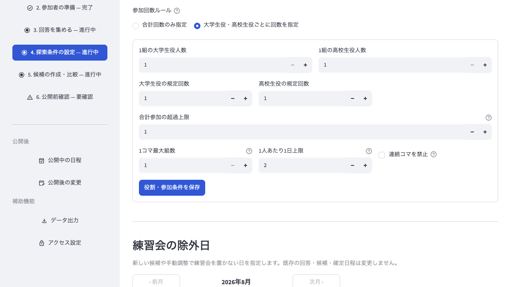

*図6. 工程4の「成立条件」。候補が成立するための条件を設定します。*

候補を比較するときは、まず必須条件が `満足` かどうかを見ます。その後で `総合適合度` を比較します。総合適合度は100点満点で、100が設定した方針に最も合う値です。点数だけで決めず、日程の見やすさ、参加者別集計、参加回数の偏りも確認します。

#### 除外日を使うとき

練習会を実施しない日がある場合は、`練習会の除外日` で指定します。

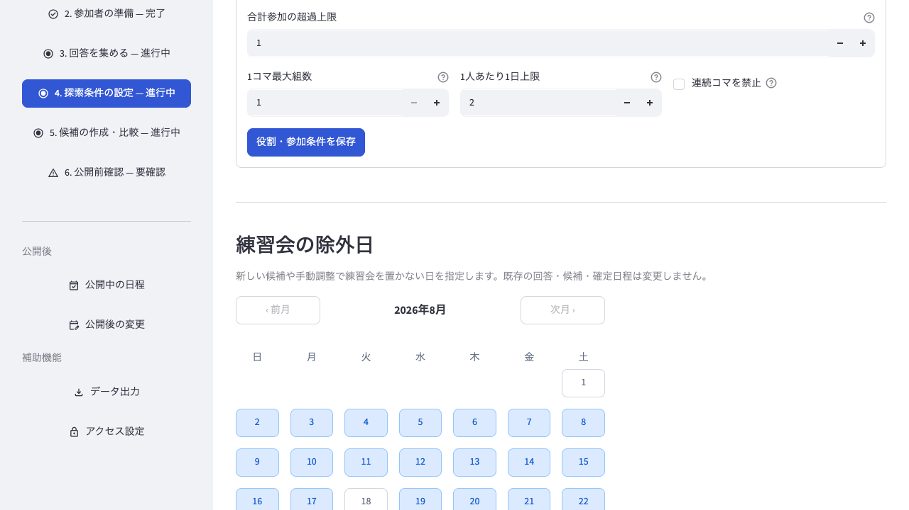

*図7. 「練習会の除外日」。新しい候補や手動調整で使用しない日を指定します。*

除外日は、新しい候補や手動調整に反映されます。一方、既存の回答・保存済み候補・確定日程は変更されません。除外日を設定した後は、候補を作り直すか、既存候補・確定日程に対象日が残っていないかを別途確認します。

### 2.6 工程5「候補の作成・比較」は3つの画面を使い分ける

工程5は、`候補作成`、`候補一覧・詳細`、`候補調整` の3つに分かれています。基本の考え方は、候補を作る、候補を比べる、必要なら調整する、です。

#### 候補作成

`最適化探索` は条件に基づいて候補を自動で探す方法です。`手動+自動調整` は、担当者がカレンダーで配置を調整したうえで、自動調整を使う方法です。

保存済み候補があるときは、通常は `追加で探索（保存候補は残す）` を使います。保存候補を残したまま、比較対象を増やせます。保存候補を置き換えるのは、作り直す目的が明確なときだけにします。

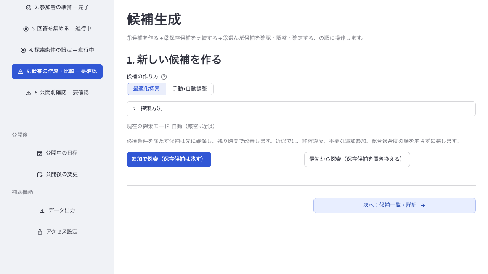

*図8. 「候補作成」。探索方法と、保存候補を残すか置き換えるかを選びます。*

v2.0.0では、旧版で保存した候補について、現在の評価条件で再計算した点数であることを知らせる表示が出る場合があります。旧版当時の点数と考えず、現在の評価条件で候補を見直します。

#### 候補一覧・詳細

候補を比較する順番は、次のとおりです。

1. 必須条件が `満足` か
2. 総合適合度がどの程度か
3. 開催組数、評価項目の内訳、日程概要に無理がないか
4. 参加者別集計で、特定の参加者に偏りがないか

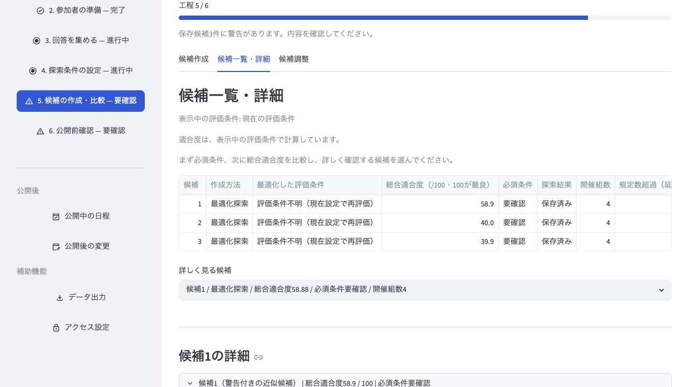

*図9. 「候補一覧・詳細」。必須条件を先に確認し、その後で総合適合度を比較します。*

#### 候補調整

候補調整では、カレンダー上の組を選び、開催形式や参加者の役割を確認・変更します。調整した内容は元の候補を残したまま、新しい候補として保存されます。

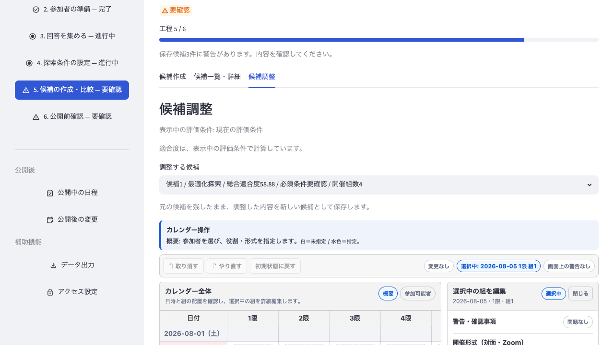

*図10. 「候補調整」。元候補を残したまま、調整結果を別候補として保存します。*

### 2.7 工程6「公開前確認」は公開してよいかを判断する画面

公開前確認では、選択した候補について、必須条件、総合適合度、評価内訳、日程一覧、参加者別集計を確認します。警告がある場合は、警告の内容を確認してから判断します。

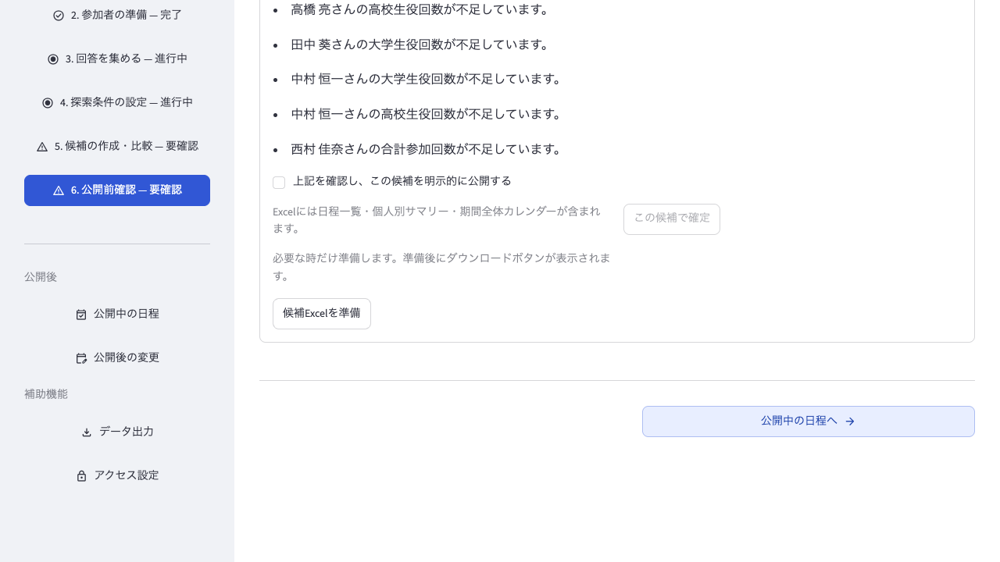

*図11. 「公開前確認」の下部。警告を確認し、明示的に公開するかを判断します。*

必須条件に未達がある候補を公開する場合は、警告を読んだうえで `上記を確認し、この候補を明示的に公開する` にチェックします。チェックは警告を解消するものではありません。公開してよい理由がある場合だけ行います。

公開後は、左側の `公開中の日程` で公開版を確認し、必要に応じて `データ出力` から日程一覧・個人別サマリー・期間全体カレンダーを準備します。

### 2.8 公開後の変更は専用の流れで行う

確定後に変更が必要になった場合は、`公開後の変更` を使います。公開中の日程を直接書き換えるのではなく、変更依頼や固定したい内容を確認し、改訂候補を作成してから再公開します。

現在の公開版を残したまま変更内容を比較できるため、変更前の公開版と変更後の候補を取り違えないようにします。変更理由や参加者への連絡内容も、担当者間で確認してから再公開します。

## 3. 参加者向け

### 3.1 企画概要で最初に確認すること

参加者画面では、企画を選び、自分の名前を確認します。`企画概要` には、企画の状態、対象期間、入力締切、自分の入力状態が表示されます。

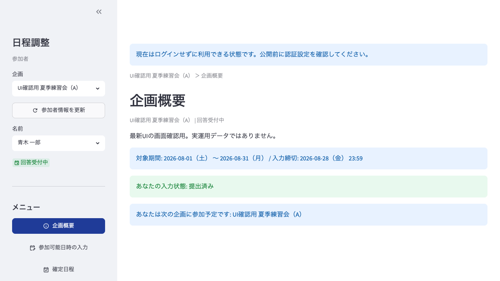

*図12. 「企画概要」。対象期間、締切、自分の入力状態を確認します。*

共有アカウントを使う場合は、入力を始める前に左側の名前を必ず確認します。名前を間違えたまま保存すると、別の参加者の回答として扱われます。

### 3.2 参加可能日時の入力で見るところ

`参加可能日時の入力` では、日付ごとの時限を選びます。通常日は、各コマのチェックで参加可・不可を切り替えます。

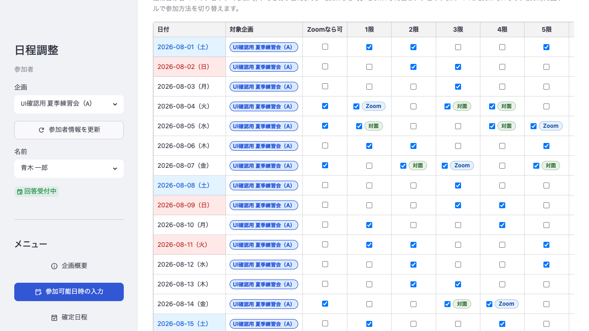

*図13. 参加可能日時の入力。時限の可否と、Zoom可の日を一覧で確認します。*

`Zoomなら可` をオンにした日は、チェックしたコマについて `Zoom` と `対面` の参加方法を切り替えられます。参加できる時間だけでなく、Zoomでも参加できるかまで正しく入力すると、担当者が候補を作りやすくなります。

### 3.3 提出・下書き・更新しないの違い

入力が終わったら、画面下部の `提出確認` で企画ごとの扱いを選びます。

- `提出`: 今回の回答を提出する
- `下書き`: 回答を保存するが、提出扱いにはしない
- `更新しない`: 今回はその企画の保存状態を変更しない

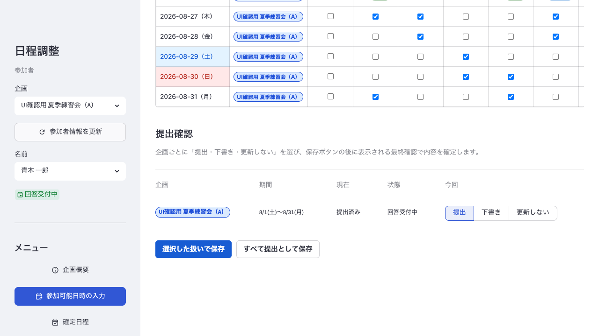

*図14. 「提出確認」。企画ごとの扱いを選び、保存方法を決めます。*

保存ボタンを押した後は、保存内容の最終確認が表示されます。保存対象の企画、選択中の参加可能コマ数、Zoomなら可の数を確認します。共有アカウントでは、自分の名前を入力して本人確認を完了させます。

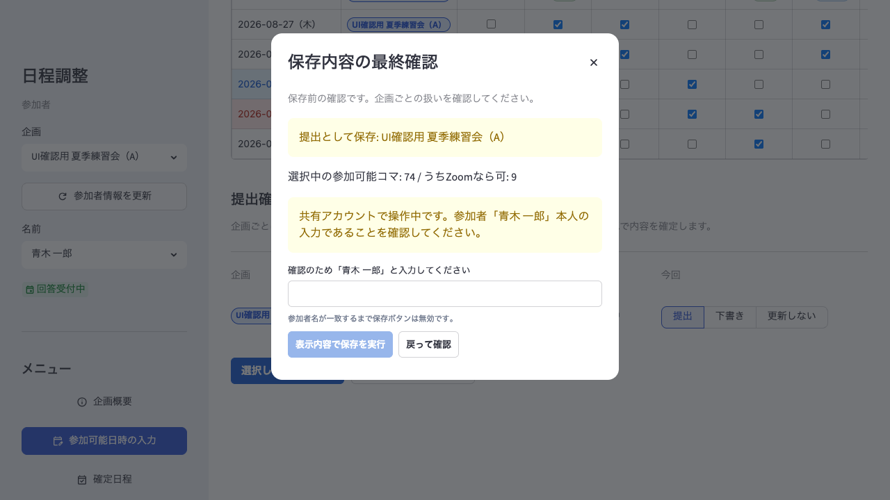

*図15. 保存内容の最終確認。内容と本人名を確認してから保存を実行します。*

保存後は、入力状態が意図した状態になったことを確認します。`下書き` のままでは、担当者が提出済みの回答として扱えない場合があります。

### 3.4 確定日程で公開版を確認する

担当者が日程を公開すると、`確定日程` で公開版、公開日時、自分の役割・参加日時を確認できます。表示は `カレンダー表示` / `一覧表示`、`週ごと` / `期間全体`、役割名表示 / 色分けから選べます。

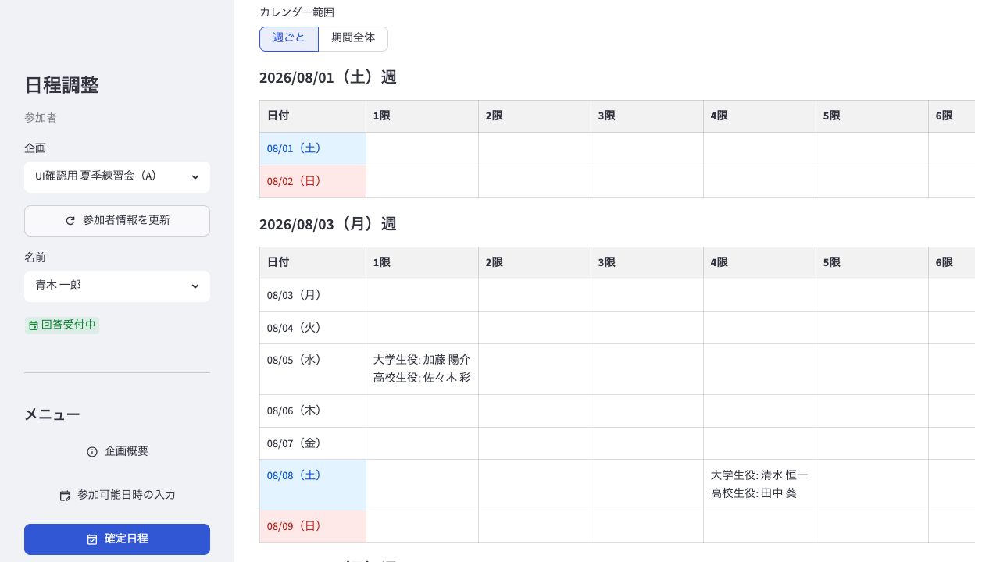

*図16. 「確定日程」。公開された予定を週単位で確認します。*

回答受付が終了した後は、回答内容を閲覧できても変更できない場合があります。変更が必要なときは、担当者へ連絡します。

## 4. よくある確認

### 参加者が提出したのに候補へ反映されない

担当者側で、次の点を確認します。

- 企画データを再読み込みしたか
- 参加者が `日調対象` になっているか
- 承認や所属など、参加者設定が整っているか
- 入力状態が `提出済み` になっているか
- `代理入力` の回答を使う場合、内容と使用元が正しいか

### もっと候補を増やしたい

候補作成で `追加で探索（保存候補は残す）` を使います。比較済みの候補を残したまま、別の候補を追加できます。

### 特定の日を候補から外したい

工程4の `練習会の除外日` を保存してから、新しい候補を作成します。既存候補や確定日程は自動で変更されないため、必要なら別途見直します。

### 公開後に一部だけ変更したい

`公開後の変更` から改訂候補を作成します。変更前の公開版を確認し、固定したい日時や変更理由を整理してから再公開します。

### 保存後も表示が変わらない

参加者は最終確認で、提出対象・人数・本人名を確認します。担当者は保存後のメッセージを確認し、他の担当者の変更が疑われる場合は企画データを再読み込みします。

## 5. 最終チェック

### スケジュール担当者

- [ ] 工程1で企画名・説明・本番日を確認した
- [ ] 工程2で班構成・名簿・日調対象を確認した
- [ ] 工程3で受付期間・締切・提出状況・回答内容を確認した
- [ ] 工程4で成立条件・個別条件・評価条件・除外日を確認した
- [ ] 工程5で必須条件を先に確認し、候補を比較・調整した
- [ ] 工程6で警告と参加者からの見え方を確認して公開した
- [ ] 公開後に公開版と必要な出力データを確認した

### 参加者

- [ ] 企画名と自分の名前を確認した
- [ ] 対象期間の参加可能日時を入力した
- [ ] Zoom参加の可否を入力した
- [ ] `提出`・`下書き`・`更新しない` の扱いを選んだ
- [ ] 最終確認を完了し、入力状態を確認した
- [ ] 日程確定後に `確定日程` を確認した

困ったときは、企画名、参加者名、表示された状態、最後に押したボタン、表示されたメッセージを添えて、スケジュール担当者またはシステム管理者へ連絡してください。
