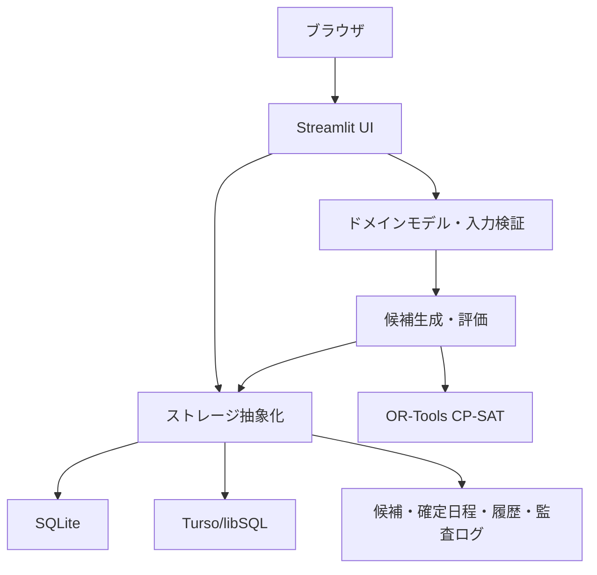

# 日程調整ツール 技術概要

## 1. 文書の目的

この資料は、日程調整ツールそのものについて技術的な議論を行うための概要資料である。特定のサービス、サーバー、ホスティング方式、データ連携先を前提にせず、現行実装の機能、構成、データ、アルゴリズム、実行環境、性能、セキュリティ、運用上の論点を整理する。

記載内容は、現行ソースコードと設定ファイルから確認できる事項、過去の検証で得られた参考値、今後確認が必要な事項を分けて扱う。

## 2. 基準情報

| 項目 | 内容 |
| --- | --- |
| 対象バージョン | ver2.0.0 |
| ソース基準 | ローカル `main` のコミット `e663094` |
| バージョン定義 | `src/schedule_adjustment_tool/version.py` の `2.0.0` |
| アプリケーション方式 | Python上で動作するStreamlitアプリケーション |
| 主な利用者 | システム管理者、日程担当者、参加者 |
| 主な保存先 | SQLiteまたはTurso/libSQL |

### 情報の確度

- **実装確認**: 現在のソースコード、設定ファイル、依存関係から確認できる事項。
- **計測参考**: 特定の検証環境・データ量・利用条件で実測された参考値。
- **未確認**: 実際の利用規模や同時利用条件など、対象環境で測定していない事項。

## 3. システムの概要

日程調整ツールは、参加者の参加可能日時と企画条件を入力として、練習会などの候補日程を生成・比較し、必要に応じて手動調整したうえで確定するWebアプリケーションである。

単なる空き時間の集計ではなく、次の条件を同時に扱う。

- 参加者ごとの参加可能日時
- 対面参加とZoom参加の違い
- 大学生役・高校生役などの役割
- 班、期、文理などの参加者属性
- 参加者ごとの必要参加回数と超過上限
- 1回あたりの役割別人数
- 同時開催数
- 1人あたりの1日参加上限
- 連続時限の回避
- 本番日や避けたい時限
- 複数企画間の確定日程上の競合
- 公開後の変更依頼と改訂履歴

## 4. 主な機能

### 4.1 管理・日程担当者向け機能

- 企画の作成・編集・状態管理
- 日程調整期間、曜日、時限、締切の設定
- 参加者の登録・削除・有効化・承認
- 参加者属性、班、役割、参加回数条件の設定
- 参加者の回答状況確認
- 参加者回答の代理入力・本人入力への復帰
- 候補生成、追加探索、候補置換、候補比較
- 候補の詳細確認、カレンダー表示、参加者別集計
- 手動調整、固定セッション、役割割当の変更
- 候補の確定と公開済み日程の改訂
- 確定日程、候補、参加者情報、入力状況のExcel出力
- 参加者アカウントの管理
- 監査ログ、バックアップ、復元などの保守操作

### 4.2 参加者向け機能

- 利用可能な企画の選択
- 自分の参加可能日時の入力
- 対面参加可能日時とZoomなら参加可能な日時の入力
- 下書き保存
- 提出済みとして保存
- 企画ごとに異なる保存状態の確認
- 保存前の本人確認

### 4.3 現在の入口

| 用途 | 入口ファイル |
| --- | --- |
| 管理・日程担当者向け | `app.py` |
| 参加者向け | `participant_app.py` |
| 参加者向けCloudラッパー | `participant_cloud/participant_app.py` |

## 5. 処理構成



実装は、概ね次の層に分かれている。

| 層 | 主な責務 | 代表的な場所 |
| --- | --- | --- |
| 入口 | Streamlitを起動する | `app.py`, `participant_app.py` |
| UI | 画面、入力、画面状態、表示 | `src/schedule_adjustment_tool/ui/` |
| ドメイン | モデル、条件、候補生成、評価、日程検証 | `src/schedule_adjustment_tool/domain/` |
| 保存 | SQLite/Tursoの読み書き、CAS、履歴、監査 | `src/schedule_adjustment_tool/storage/` |
| 出力 | Excel、CSV、カレンダー表示用データ | `src/schedule_adjustment_tool/exports/`, `ui/csv_exports.py` |
| テスト | ドメイン、保存、UI、ストレージ互換性 | `tests/` |

## 6. 実行環境

### 6.1 Pythonと主要依存関係

| 項目 | 現行値 | 用途 |
| --- | --- | --- |
| Python | 3.12以上 | アプリケーション実行環境 |
| Streamlit | 1.58.0 | Web UI・セッション管理 |
| OR-Tools | 9.15.6755 | CP-SAT候補生成 |
| pandas | 2.3.3 | 表形式データ処理・出力 |
| PyArrow | 24.0.0 | Streamlit表データ処理など |
| libsql | 0.1.11 | Turso/libSQL接続 |
| Pillow | 12.3.0 | 画像関連依存 |
| GitPython | 3.1.58以上 | アプリケーション依存関係 |

管理アプリ用の依存関係にはOR-Toolsが含まれる。参加者画面だけを動かす依存関係は、候補生成を行う管理画面より小さい構成になっている。

### 6.2 Docker実行例

リポジトリには、`python:3.12-slim`をベースにしたDockerfileがある。

- 実行ユーザーはrootではなく`app`。
- Streamlitの待受ポートは`8501`。
- データ保存先として`/app/data`を利用する。
- ヘルスチェックは`/_stcore/health`へ行う。
- Compose例ではread-only filesystem、`tmpfs`、`no-new-privileges`を設定している。
- CPU・メモリのresource limitはCompose例では指定していない。

### 6.3 Streamlit設定

現行設定には次の特徴がある。

- headless実行
- CORS有効
- XSRF保護有効
- アップロード上限10MB
- file watcher無効
- 利用統計送信無効
- 画面上の詳細エラー非表示
- UIテーマとサイドバー文字色を指定

file watcherが無効なため、ソース更新を反映する場合はアプリケーションの再起動が必要になる環境がある。

## 7. 保存方式とデータ構造

### 7.1 ストレージバックエンド

保存処理は共通のストレージ境界を介して、SQLiteまたはTurso/libSQLへ切り替えられる。

| バックエンド | 特徴 |
| --- | --- |
| SQLite | ローカルファイルに保存する。データファイルの永続化とバックアップが必要 |
| Turso/libSQL | リモートのlibSQL系データベースへ接続する。接続URLと認証トークンが必要 |

SQLiteとTursoには対応する公開関数があり、同じ概念の読み書きを実装している。ただし、ローカルSQLiteでの成功は、リモートDBの遅延、障害、バックアップ、性能を保証するものではない。

### 7.2 主なデータ単位

| データ単位 | 意味 |
| --- | --- |
| `project` | 一つの日程調整企画 |
| `documents` | 企画設定、参加者スナップショット、候補、履歴などのJSON互換データ |
| `common_participants` | 複数企画で共有可能な参加者基本情報 |
| `project_participations` | 企画ごとの参加者設定、属性、回答、保存バージョン |
| `candidate_data` | 未公開の候補日程 |
| `confirmed_candidate_data` | 旧形式互換用の確定日程データ |
| `schedule_revisions` | 確定・公開された日程のrevisionメタデータ |
| `schedule_sessions` | revision内の各セッション |
| `session_assignments` | セッション内の参加者・役割割当 |
| `active_schedule_revisions` | 現在有効なrevisionへのポインタ |
| `schedule_migrations` | 日程データ移行の記録 |
| `system_settings` | システム全体の設定 |
| `backups` | 復元用バックアップ |
| `audit_logs` | 操作者、操作、対象、時刻、詳細 |
| `users` | 利用者アカウントと権限 |
| `memberships` | 利用者と企画・参加者の関係 |
| `job_locks` | 企画単位の処理ロック |

### 7.3 IDとバージョン

- 企画、参加者、セッション、revisionには安定したIDがある。
- 表示名ではなくIDを基準に参加者や割当を識別する。
- 企画設定、参加者行、候補、revisionには保存バージョンまたはrevision情報がある。
- 保存時に期待バージョンを確認し、他の利用者が先に変更していた場合は競合として拒否する経路がある。
- アプリケーションバージョン`2.0.0`、設定の`schema_version`、保存行のversion、schedule revision番号は別の概念である。

### 7.4 互換性と履歴

新しいschedule revision構造を使いながら、旧形式のJSONドキュメントも互換性・復元・ロールバック用に残している。確定日程を扱う処理では、現在の表示内容だけでなく、revision、親revision、作成元、変更理由、作成者、監査ログを考慮する必要がある。

## 8. ドメイン上の前提

### 8.1 企画状態

企画は次の状態を持つ。

```text
draft       準備中
collecting  回答受付中
closed      回答締切
confirmed   確定済み
```

企画状態と参加者の回答状態は別に管理される。回答が全員提出済みでも、企画状態が`collecting`なら回答受付中として扱われる。

### 8.2 回答状態

```text
not_started  未入力
draft        下書き
submitted    提出済み
```

回答保存可否は、企画状態、締切、締切後編集許可の組合せで決まる。参加者画面と保存層でこの判定を共有する設計になっている。

### 8.3 日付・時刻

- 日付は基本的にISO 8601の`YYYY-MM-DD`。
- 参加可能コマは`YYYY-MM-DD#時限`形式のスロットキーで扱う。
- 既定タイムゾーンは`Asia/Tokyo`で、設定により変更できる。
- 保存時刻や更新時刻はUTCのISO 8601形式で記録する。
- 現行の企画設定・UIでは対象時限を通常1〜6限として扱う。
- 日程構造の正規化処理は、手動・互換データの検証として1〜24時限を受け付ける。

### 8.4 開催形式

開催形式は次の2種類である。

```text
in_person  対面
zoom        Zoom
```

参加者の回答では、対面可能なコマと、Zoomなら可能なコマを区別する。Zoomだけ可能なコマを対面可能として扱わない。

### 8.5 除外日

除外日は、新しく候補を生成したり、手動でセッションを追加したりする対象から外すために使う。一方、既存の候補や確定日程を除外日になったという理由だけで自動削除する仕様ではない。既存日程は保持し、必要に応じて警告として扱う。

### 8.6 参加者の対象判定

通常の候補生成対象は、概ね次の条件を満たす参加者である。

- 有効である。
- 登録承認済みである。
- 企画の日程調整対象に含まれている。
- 必要な回答状態を満たしている。

名簿に存在することと、候補生成対象であることは同じではない。

## 9. 候補生成アルゴリズム

### 9.1 使用技術

候補生成にはOR-Tools CP-SATを使用する。候補生成時に、日時、開催形式、組、役割、参加者割当などの組合せを制約モデルとして構築し、制約を満たす候補を探索する。

### 9.2 主な入力

- 企画設定
- 対象参加者
- 参加可能日時
- Zoom可能日時
- 役割別人数
- 班・文理・期などの属性
- 参加回数の必須条件
- 超過許容数
- 1コマ最大組数
- 1人あたりの1日上限
- 連続時限回避
- 使用不可スロット
- 固定セッション
- 役割・参加者の割当ロック
- 探索時間、候補数、乱数シード

### 9.3 探索モード

```text
auto          通常探索。必要に応じて近似候補へフォールバック
strict_only   必須条件を満たす候補だけを探索
relaxed_only  近似候補を探索
```

### 9.4 探索の優先順位

現行ver2.0.0では、評価点を最初から単純に最大化するのではなく、候補を見つけることと必須条件・違反量を優先する段階的な探索を行う。

厳密候補では、概ね次の順で処理する。

1. 必須条件を満たす候補を発見する。
2. 残りの探索時間で評価上の改善を試みる。

近似探索では、概ね次の順で処理する。

1. 必須条件の違反量を小さくする。
2. 余分な参加回数を小さくする。
3. 評価上の改善を試みる。

複数候補を作成する場合も、候補ごとに探索時間を完全に使い切るのではなく、共有された締切時間の中で探索する。

### 9.5 探索結果の状態

候補には、次のような探索メトリクスが保存される。

- solver status
- solver wall time
- objective value
- best objective bound
- relative gap
- 探索フェーズ
- 必須条件違反の最小値を証明できたか
- 余分な参加回数の最小値を証明できたか
- 評価最適性を証明できたか
- 固定セッション数
- 割当ロック数

`FEASIBLE`や`UNKNOWN`は、候補が得られたことと最適性が証明されたことを区別するために保持する。

## 10. 評価方式

### 10.1 評価項目

現在の評価項目には次がある。

- 本番直前期間の回避
- 避ける時限
- Zoom開催
- 期による経験バランス
- 大学生役の同班編成
- 班と高校生役の文理対応
- 開催組数
- 個人の複数回参加配置
- 企画全体の日程配置

### 10.2 総合適合度

- 総合適合度は0〜100点。
- 100が最も設定方針に適合する。
- 個別評価は内部でペナルティとして正規化される。
- 同じ優先度の項目は、最大ペナルティ60%と平均ペナルティ40%でまとめる。
- 優先度は`最優先:優先:考慮 = 4:2:1`で反映する。
- 優先度が高いことは必須条件であることを意味しない。
- 役割人数や参加回数など、必ず守る条件は別の必須条件として扱う。

候補表示、候補一覧、Excel出力、保存済み候補の再評価では、同じ「総合適合度（100が最良）」の向きを維持する。

## 11. 手動調整・確定・改訂

### 11.1 候補と確定日程の違い

- 候補は未公開の検討案であり、再生成・追加・置換の対象になる。
- 確定日程は参加者へ公開する日程であり、候補とは別の保存単位である。
- 確定後の変更は、現在の公開日程を基準とする改訂として扱う。
- 公開済みのrevisionは、後から内容を上書きするのではなく、親revisionを持つ新しいrevisionとして保存する。

### 11.2 手動変更の前提

手動で変更したセッション、役割割当、固定した参加者などは、次の探索で固定条件や割当ロックとして扱える。すでに公開済みの日程を変更する場合は、変更しない部分と変更対象を区別する。

### 11.3 確定時の検証

確定時には、少なくとも次を検証する。

- セッションの日付、時限、組、開催形式の構造
- 同一セッション内の参加者重複
- 同一時刻の参加者重複
- 未登録・対象外参加者の割当
- 役割別人数
- 参加者ごとの参加回数
- 企画条件との違い
- 複数企画の公開日程との競合
- 別利用者による先行更新

## 12. 出力

### 12.1 Excel

主なExcel出力には次がある。

- 候補日程
- 候補カレンダー
- 参加可能日時カレンダー
- 確定日程
- 参加者別サマリー
- 参加者・属性・入力状況

Excelは利用者が確認・配布するための出力であり、現時点で機械連携用の安定した外部API形式として定義されているものではない。

### 12.2 CSV

アカウント情報などのCSV出力がある。CSVでは、Excelなどで式として解釈される文字列を無害化する処理が入っている。

### 12.3 JSON

管理用の全データ出力や互換性のためのJSONデータがある。JSON出力の可否は設定で制御される。保存用JSONの内部構造は、現時点で一般利用者向けの安定APIスキーマとして保証されているものではない。

## 13. 認証・セキュリティ

### 13.1 認証と権限

- 認証は既定で必須。
- システム管理者、日程担当者、参加者などの権限を持つ。
- 企画ごとのmembershipにより、利用可能な企画・操作範囲を管理する。
- ログイン失敗回数とロック時間を設定できる。
- 公開運用ではHTTPS、秘密情報の安全な保管、認証必須設定が必要である。

### 13.2 パスワード・秘密情報

- パスワードはハッシュや暗号化された秘密情報として保存する。
- パスワード暗号化用の秘密鍵を環境変数またはSecretsで指定する。
- DB URL、DBトークン、秘密鍵、初期管理者パスワードをGitへ保存しない。
- パスワードの再発行・CSV出力は個人情報として扱う。

### 13.3 出力の安全性

- CSVの式インジェクション対策がある。
- XLSX生成時にXMLで許可されない文字を除去する。
- 個人情報を含むExcel・CSVは保存先と配布先を限定する必要がある。

### 13.4 監査

次のような操作を監査ログへ記録する。

- 企画設定の変更
- 参加者・属性の変更
- 回答の保存・代理入力
- 候補の生成・削除・確定
- 確定日程の解除・改訂
- アカウント操作
- バックアップ・復元

## 14. 性能特性と参考計測

### 14.1 負荷が高くなり得る処理

- CP-SATモデル構築
- CP-SATソルバー実行
- 複数候補の連続探索
- 候補検証・評価
- 候補詳細の表・カレンダー・集計生成
- pandas/PyArrowによるExcel準備
- Streamlitの再実行とブラウザ再描画
- 多数参加者の回答保存と互換スナップショット再構築

現行コードではCP-SATの探索ワーカー数を1にしている。候補生成を並列化する場合は、CPUだけでなくソルバーとPythonプロセスのメモリ増加も測定する必要がある。

### 14.2 参考実測

過去に、1操作者・同時操作なし・検証用データの条件で、次の参考値が記録されている。対象コードは現在のローカルmainと完全一致しない可能性があるため、性能保証ではなく規模感の参考値とする。

| 操作 | 参考値 |
| --- | ---: |
| 20人企画から50人企画への切替 | 約4.3秒 |
| 候補作成・比較画面の表示 | 約0.81秒 |
| 50人企画で追加探索 | 約16.9秒 |
| 候補一覧・詳細表示 | 約9.1秒 |
| 候補Excel準備 | 約5.3秒 |
| 確定日程Excel準備 | 約4.1秒 |
| 回答表の1セル変更 | 約1.6秒 |

同じ検証DBに対するPython・ストレージ処理単体では、次の値が記録されている。

| 処理 | 参考値 |
| --- | ---: |
| 企画データ読込（50人） | 約0.59秒 |
| 参加者一覧読込（48人） | 約0.35秒 |
| 候補保存（3件） | 約0.48秒 |
| 候補生成（40人） | 約4.53秒 |
| 候補生成（50人） | 約4.47秒 |
| 候補生成プロセス最大RSS（50人） | 約226.5MB |
| 全データ出力API | 約1.21秒 |

回答保存は、1件約0.72秒から48件約21.58秒まで増加する測定結果がある。複数回答を保存する経路で、企画全体の互換スナップショットを繰り返し再構築する処理が影響していると分析されている。

### 14.3 性能評価の限界

- 1ユーザーの画面計測は、同時利用性能を示さない。
- Python API単体の計測は、Streamlit再実行やブラウザ描画を含まない。
- プロセスRSSは、ホスト全体、DB、他セッションのメモリを含まない。
- ローカルSQLiteの性能は、リモートlibSQLのネットワーク遅延を示さない。
- 候補生成時間は参加者数だけでなく、対象日数、時限数、役割条件、候補数、制約密度に依存する。
- 実際の受入判定には、想定する最大データ量と同時利用数で再測定が必要である。

## 15. 設定値と運用上限

主な設定値は環境変数またはStreamlit Secretsから読み込む。変更後は通常アプリケーションの再起動が必要である。

| 設定 | 既定値 | 許容範囲 |
| --- | ---: | ---: |
| `SCHEDULE_MAX_SEARCH_SECONDS` | 600秒 | 1〜1200秒 |
| `SCHEDULE_MAX_CANDIDATES` | 50件 | 1〜200件 |
| `SCHEDULE_MAX_STORED_CANDIDATES` | 50件 | 1〜200件 |
| `SCHEDULE_MAX_TARGET_PERIOD_DAYS` | 90日 | 1〜366日 |
| `SCHEDULE_MAX_TEXT_LENGTH` | 120文字 | 20〜1000文字 |
| `SCHEDULE_MAX_DESCRIPTION_LENGTH` | 4000文字 | 200〜20000文字 |
| `SCHEDULE_MAX_FAILED_LOGINS` | 5回 | 1〜100回 |
| `SCHEDULE_LOGIN_LOCK_SECONDS` | 300秒 | 10〜3600秒 |
| `SCHEDULE_BACKUP_LIMIT` | 20件 | 1〜200件 |
| `SCHEDULE_DELETED_RETENTION_DAYS` | 30日 | 1〜3650日 |
| `SCHEDULE_AUDIT_RETENTION_DAYS` | 365日 | 1〜3650日 |

注意点として、全体の環境変数による上限と、企画ごとの`Config`既定値は別に存在する。例えば、アプリ全体の探索時間上限は600秒だが、企画設定の探索時間既定値は120秒、企画の候補表示数の既定値は1件である。

## 16. 障害・同時更新・復元

### 16.1 同時更新

保存処理では、期待バージョン、CAS、トランザクション、revision guardなどを使い、別利用者の先行更新を検知する。競合が起きた場合は、最新データを再読込してから操作をやり直す必要がある。

### 16.2 トランザクション

参加者回答や企画設定などの保存は、途中まで保存されて後半だけ失敗する状態を避けるため、関連する更新を一つのトランザクション単位で扱う経路がある。

回答一括保存では、対象企画の設定バージョン、受付可否、回答更新を同じ保存単位で検証する。条件不一致がある場合は全体をロールバックする。

### 16.3 バックアップと復元

- 保存前バックアップやシステム内バックアップを保持する。
- SQLiteでは、WAL動作中のファイルを単純コピーするのではなく、アプリ停止、SQLite Backup API、`VACUUM INTO`などを考慮する。
- スキーマ変更や日程revision移行は、コピーまたは検証環境でdry-runしてから適用する。
- 旧形式データ、revision、CASバージョン、暗号化済みパスワードの復元可能性を確認する。

### 16.4 探索失敗

候補生成が時間上限に達した場合、候補が一つもない場合、必須条件を満たせない場合、近似候補が返る場合を区別する必要がある。`UNKNOWN`を最適解確定と表示してはならない。

## 17. 現在の技術的な制約・未確認事項

- 外部公開用のREST API、OpenAPI、Webhook仕様は現行リポジトリにない。
- 内部Python関数やDBテーブルは、一般利用者向けの安定した公開API契約としては定義されていない。
- 最大参加者数、最大企画数、同時利用者数に対する正式な容量保証はない。
- 候補生成の最悪ケースに対する一律の所要時間保証はない。
- リモートDBの遅延やプロバイダ障害を含む本番性能は、ローカルテストだけでは確認できない。
- 実ブラウザ、認証有効、複数同時利用者を組み合わせた全操作の受入確認は、対象環境ごとに必要である。
- Streamlitの再実行、コンポーネント描画、表・Excel準備が画面操作時間に影響する。
- 旧形式互換データが残るため、保存スキーマを外部の固定契約として直接利用する場合は追加の整理が必要である。

## 18. 技術議論で確認すべき一般項目

特定の実行場所を前提にせず、次の項目を確認すると、導入・運用規模を判断しやすい。

### 実行環境

- Pythonのバージョンを固定できるか。
- 必要なネイティブ・バイナリ依存関係をインストールできるか。
- 長時間の候補探索を許可できるか。
- アプリケーションを再起動・監視できるか。
- 永続的なデータ保存先を利用できるか。

### データ規模

- 最大参加者数。
- 最大企画数。
- 企画あたりの対象日数・時限数。
- 1企画あたりの候補数。
- 参加者1人あたりの所属企画数。
- 保存する監査ログ・バックアップの保持期間。

### 利用形態

- 同時に回答する参加者数。
- 同時に候補生成を実行する日程担当者数。
- 同時に候補詳細やExcelを表示する人数。
- 1日あたりの候補生成回数。
- 許容する画面応答時間と探索待ち時間。

### 保守・安全性

- 認証・権限の管理主体。
- 個人情報とパスワードの保存場所。
- バックアップと復元の担当者。
- 障害時の通知、再起動、再試行の方法。
- バージョンアップ時のデータ互換性確認方法。
- 実ブラウザ、認証、同時利用、負荷試験の実施方法。

## 19. 参照ファイル

- バージョン: `src/schedule_adjustment_tool/version.py`
- アプリ入口: `app.py`, `participant_app.py`
- 企画・参加者モデル: `src/schedule_adjustment_tool/domain/models.py`
- タイムゾーン・運用設定: `src/schedule_adjustment_tool/domain/app_config.py`
- 候補探索: `src/schedule_adjustment_tool/domain/scheduler.py`
- 評価計算: `src/schedule_adjustment_tool/domain/evaluation_config.py`
- 日程構造・ポリシー検証: `src/schedule_adjustment_tool/domain/schedule_model.py`
- ストレージ切替: `src/schedule_adjustment_tool/storage/__init__.py`
- SQLite/Turso保存: `src/schedule_adjustment_tool/storage/`
- revision保存: `src/schedule_adjustment_tool/storage/schedule_revision_store.py`
- 出力: `src/schedule_adjustment_tool/exports/`, `src/schedule_adjustment_tool/ui/csv_exports.py`
- 依存関係: `requirements/manager.txt`, `requirements/participant.txt`, `requirements/docker.lock`
- Docker: `Dockerfile`, `deploy/docker-compose.example.yml`
- Streamlit設定: `.streamlit/config.toml`, `.streamlit/secrets.example.toml`
- 運用設定例: `.env.example`
- 性能監査の参考記録: `docs/audits/2026-08-10-cloud-performance-audit.md`
- 現行運用ガイド: `docs/USAGE_GUIDE.md`

## 20. 開発時の基本確認

```bash
PYTHONDONTWRITEBYTECODE=1 PYTHONPATH=src .venv/bin/python -m unittest discover -s tests -q
```

このコマンドによるローカルテストは、利用するDB、ブラウザ、ホスティング環境、ネットワーク、同時利用者数の性能保証を意味しない。静的確認、単体テスト、結合テスト、実ブラウザ確認、負荷試験、実運用環境の確認は分けて評価する。
